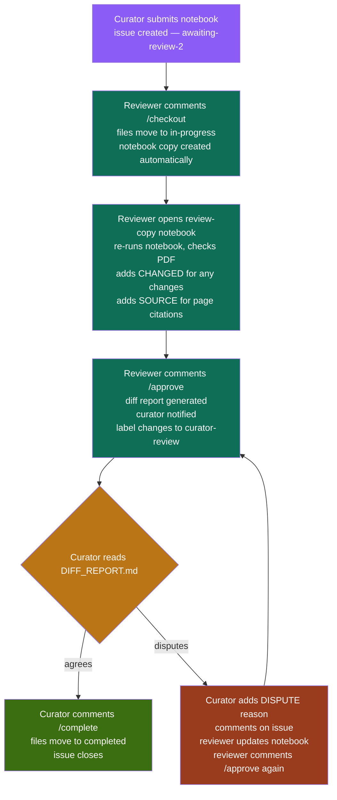

# Reviewer Guide

Welcome! This guide walks you through how to review manuscripts in this system. If you haven't set up your computer yet, start with the [Local Setup Guide](docs/LOCAL_SETUP_GUIDE.md) first.

---

## How the system works

This repository is a shared queue for second reviews of scientific manuscripts and Jupyter notebooks. The goal is reproducibility and transparency — every decision made during a review is recorded automatically so nobody has to ask anyone what happened or why.

Here is what the system does for you automatically:

- Creates a copy of the curator's notebook for you to work in
- Compares your notebook to the original when you finish
- Records every line you changed and every reason you gave
- Notifies the curator of what changed
- Gives the curator a chance to agree or dispute before anything is finalized
- Moves files through the queue and closes issues without manual work

---

## The full review flow




## Step by step

### 1. Find something to review

Go to the repository Issues tab. Look for issues with the yellow `awaiting-review-2` label. Click one to read what it is about.

The issue body will tell you which paper folder or notebook it tracks.

> You cannot review something you curated yourself. The system checks this automatically.

---

### 2. Claim it

Comment `/checkout` on the issue. That is all you need to type.

What happens automatically:
- You get assigned to the issue
- The files move from `reviews/awaiting-review-2/` to `reviews/in-progress/`
- The label changes to `review-2-active`
- **Your copy of the notebook is created automatically**

If the paper was submitted as a loose notebook file, the system converts it into a folder with the right structure automatically.

---

### 3. Pull the files and open your copy

```powershell
git pull
```

Then open your copy of the notebook:
**Do not open or edit the original notebook.** Your copy is the one ending in `_rvd.ipynb` inside the `review-copy/` folder.

---

### 4. Do your review

- Re-run the notebook
- Compare the results against the manuscript PDF
- For each cell either agree or change

**If you agree — do nothing.** Leave the cell exactly as it is.

**If you change something — add a `#CHANGED:` comment explaining why.**

Put it above the line you changed:

```python
#CHANGED: paper states gamma = 0.1 not 0.14, curator had a typo
gamma = 0.1
```

Or at the end of the line:

```python
final_time = 1200.0 #CHANGED: changed from 1.0 to match x-axis of figure 1
```

**If you want to cite where a value came from — add a `#SOURCE:` comment:**

```python
#SOURCE: p.5 eq.(3) - recovery rate
gamma = 0.1
```

This is optional but strongly encouraged. It means anyone reading the notebook later knows exactly where each number came from without having to ask.

> Write your `#CHANGED:` reasons clearly. Someone reading the report six months from now should understand why you made the change without asking anyone.

---

### 5. Save and push your work

In VS Code open the Source Control panel, type a short commit message, click the checkmark, then click Sync Changes.

Or in the terminal:

```powershell
git add .
git commit -m "Review paper-name - changes noted"
git push
```

---

### 6. Submit your review

Go back to the issue on GitHub and comment `/approve`.

What happens automatically:
- The system compares your notebook to the curator's original cell by cell
- Every individual line you changed is counted
- A `DIFF_REPORT.md` is generated in the paper folder
- The curator is notified with a summary of what changed and why
- The label changes to `curator-review`
- **The folder does not move to completed yet** — the curator reviews first

---

### 7. Wait for the curator

The curator reads the diff report and either:

**Agrees** — they comment `/complete` and the issue closes automatically.

**Disputes** — they comment on the issue explaining why they disagree. You update your notebook and comment `/approve` again. A new diff report is generated. This continues until the curator is satisfied and comments `/complete`.

---

## For curators — after your paper is reviewed

When a reviewer comments `/approve` you will be tagged in a comment on the issue. The comment will show:

- How many lines were changed
- What each line was changed from and to
- The reason the reviewer gave for each change
- A link to the full `DIFF_REPORT.md`

You have two options:

**You agree with the changes — comment `/complete`**

This moves the folder to `reviews/completed/` and closes the issue. Only you as the curator can do this.

**You disagree with a change — comment on the issue**

Explain what you think is wrong. The reviewer will update their notebook and resubmit with `/approve`. You will get a new diff report. When you are satisfied comment `/complete`.

> `/complete` can only be used by the curator of that paper. The system checks this automatically using `team_members.yml`.

---

## Notebook conventions

| Convention | Who uses it | What it means |
|---|---|---|
| `#SOURCE: p.X eq.(Y)` | Curator and reviewer | Where this value came from in the paper |
| `#CHANGED: reason` | Reviewer only | Why this line was changed from the original |
| `#DISPUTE: reason` | Curator only | Why they disagree with the reviewer's change |

All three work with or without a space after `#`. Capitalization does not matter.

**Example of a disputed change:**

Reviewer writes:
```python
#CHANGED: paper states gamma = 0.1 not 0.14
gamma = 0.1
```

Curator disputes it by opening the reviewer notebook and adding:
```python
#DISPUTE: 0.14 is correct, see supplementary table S2 p.12
#CHANGED: paper states gamma = 0.1 not 0.14
gamma = 0.1
```

Reviewer sees the dispute, checks p.12, and either reverts their change or adds more evidence with another `#CHANGED:` comment. They then comment `/approve` again to regenerate the diff report.

---
## Commands reference

| Command | Who can use it | When | What happens |
|---|---|---|---|
| `/checkout` | Any reviewer | Issue is `awaiting-review-2` | Assigns you, moves files to in-progress, creates your notebook copy |
| `/approve` | Assigned reviewer | Issue is `review-2-active` or `disputed` | Generates diff report, notifies curator, sets curator-review |
| `/dispute reason` | Curator only | Issue is `curator-review` | Records dispute in curator_notes.md, notifies reviewer, sets disputed |
| `/complete` | Curator only | Issue is `curator-review` | Moves to completed, closes issue |
| `/release` | Assigned reviewer | Issue is `review-2-active` | Returns files to awaiting-review-2, unassigns you |

> `/dispute` requires a reason. Example: `/dispute gamma should be 0.14 not 0.1 — see supplementary table S2 p.12`
---

## If something goes wrong

**The workflow failed** — go to the Actions tab on GitHub and click the failed run to see what the error was. Post it as a comment on the issue.

**You edited the wrong notebook** — comment `/release` to return the item to the queue, then `/checkout` again. Your copy will be recreated.

**The diff report is missing** — run it manually in your terminal:

```powershell
python scripts/generate_diff_report.py "reviews/in-progress/paper-name"
```

Then push the result:

```powershell
git add .
git commit -m "manual: generate diff report for paper-name"
git push
```
