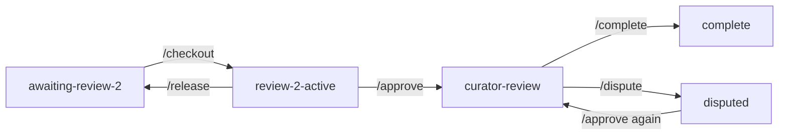

# SDE Review Queue

A system for coordinating second reviews of research manuscripts and Jupyter notebooks. Built on GitHub — no extra software needed.

The goal is reproducibility and transparency. Every decision made during a review is recorded automatically so nobody has to ask anyone what happened or why.

---

## How it works

Each manuscript that needs a second review is tracked as a GitHub issue. Reviewers browse the queue, claim a paper, do their review, and submit — all through comments on the issue. The system handles the rest automatically.

---

## What the system does automatically

When you `/checkout` a paper:
- Files move from `awaiting-review-2` to `in-progress`
- A copy of the curator's notebook is created for you to work in
- You are assigned to the issue

When you `/approve`:
- Both notebooks are compared cell by cell
- Every line you changed is counted
- A `DIFF_REPORT.md` is generated showing what changed and why
- The curator is notified with a summary
- Label changes to `curator-review`

When the curator `/dispute`s:
- Their reason is recorded in `curator_notes.md`
- The reviewer is notified
- Label changes to `disputed`
- Reviewer updates their notebook and `/approve`s again

When the curator `/complete`s:
- Files move to `completed`
- Issue closes

---

## Commands

| Command | Who | What happens |
|---|---|---|
| `/checkout` | Any reviewer | Claims the paper, creates your notebook copy |
| `/approve` | Assigned reviewer | Generates diff report, notifies curator |
| `/dispute reason` | Curator only | Records dispute, notifies reviewer |
| `/complete` | Curator only | Finalizes review, closes issue |
| `/release` | Assigned reviewer | Returns paper to the queue |

---

## Notebook conventions

Two comments your team uses while working in notebooks:

| Convention | Who | What it means |
|---|---|---|
| `#SOURCE: p.X eq.(Y)` | Curator and reviewer | Where this value came from in the paper |
| `#CHANGED: reason` | Reviewer | Why this line was changed |
| `#DISPUTE: reason` | Curator | Why they disagree with the change |

---
## Where files live

Each paper moves through three folders as it progresses:

| Folder | Meaning |
|---|---|
| `reviews/awaiting-review-2/` | Needs a second reviewer |
| `reviews/in-progress/` | Someone is actively reviewing |
| `reviews/completed/` | Both reviews done, diff report committed |

Each paper folder contains:

| File | What it is |
|---|---|
| `original/` | Curator's notebook — never edited |
| `review-copy/` | Reviewer's copy — edited during review |
| `review_metadata.yml` | Tracks who reviewed, timestamps |
| `DIFF_REPORT.md` | Auto-generated on /approve |
| `curator_notes.md` | Created if curator uses /dispute |
---

## Getting started

1. **New here?** Start with the [Local Setup Guide](docs/LOCAL_SETUP_GUIDE.md)
2. **Ready to review?** Read the [Reviewer Guide](CONTRIBUTING.md)
3. **Adding a paper?** Drop the folder into `reviews/awaiting-review-2/` and push — an issue is created automatically

---

## Team members

Team member names and GitHub usernames are mapped in `team_members.yml`. If your name is not in that file the system cannot notify you or restrict commands correctly — contact the repo maintainer to be added.
